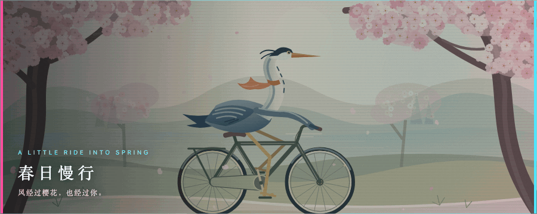
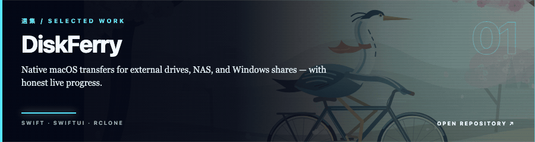
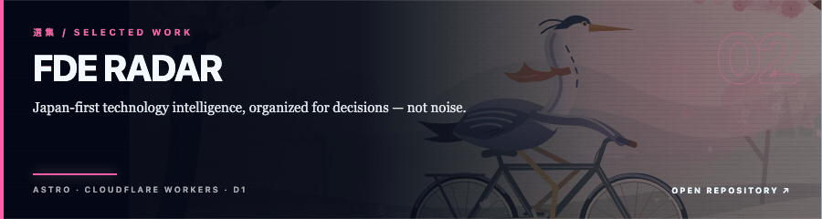
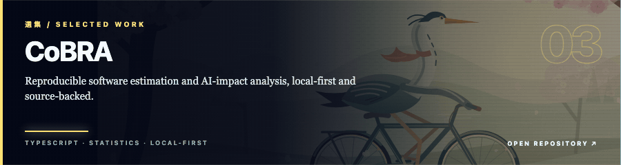
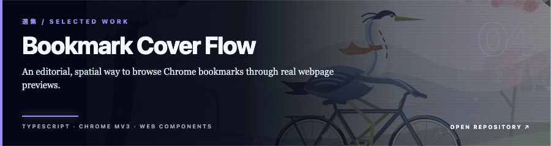
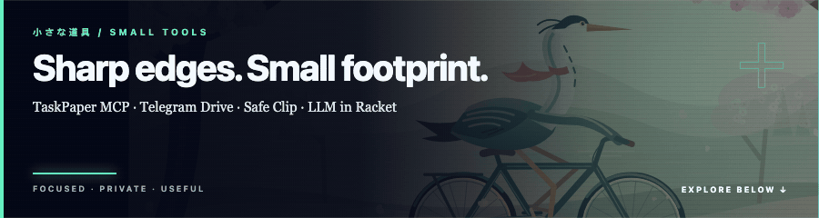
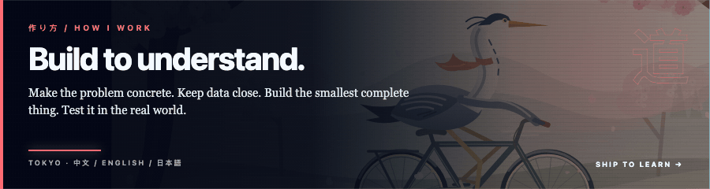

  <picture>
    <source media="(prefers-reduced-motion: reduce)" srcset="./assets/sakura-heron-profile-static.png" />
    
  </picture>

  <strong>AI、ネイティブアプリ、ローカルデータが交わる場所に、役に立つ道具を。</strong> 
  Useful software where AI, native platforms, and local data meet. · Tokyo

  <a href="https://github.com/kekincai?tab=repositories">Projects</a>
  &nbsp;·&nbsp;
  <a href="https://github.com/kekincai/ai-blog">PAUL.LOG</a>
  &nbsp;·&nbsp;
  <a href="https://stackoverflow.com/users/8745472">Stack Overflow</a>

 

<a href="https://github.com/kekincai/DiskFerry">
  <picture>
    <source media="(prefers-reduced-motion: reduce)" srcset="./assets/sections/diskferry-static.png" />
    
  </picture>
</a>

 

<a href="https://github.com/kekincai/fde">
  <picture>
    <source media="(prefers-reduced-motion: reduce)" srcset="./assets/sections/fde-static.png" />
    
  </picture>
</a>

 

<a href="https://github.com/kekincai/CoBRA">
  <picture>
    <source media="(prefers-reduced-motion: reduce)" srcset="./assets/sections/cobra-static.png" />
    
  </picture>
</a>

 

<a href="https://github.com/kekincai/bookmark-cover-flow">
  <picture>
    <source media="(prefers-reduced-motion: reduce)" srcset="./assets/sections/bookmark-static.png" />
    
  </picture>
</a>

  

<picture>
  <source media="(prefers-reduced-motion: reduce)" srcset="./assets/sections/tools-static.png" />
  
</picture>

  <a href="https://github.com/kekincai/taskpaper-mcp-server">TaskPaper MCP</a>
  &nbsp;·&nbsp;
  <a href="https://github.com/kekincai/telegram-drive-macos">Telegram Drive</a>
  &nbsp;·&nbsp;
  <a href="https://github.com/kekincai/safe-clip-popclip">Safe Clip</a>
  &nbsp;·&nbsp;
  <a href="https://github.com/kekincai/llm-racket">LLM in Racket</a>

 

<picture>
  <source media="(prefers-reduced-motion: reduce)" srcset="./assets/sections/method-static.png" />
  
</picture>

  Native Apple platforms · Web · Data · Applied AI 
  <strong>明確に考え、丁寧につくる。</strong>

