

  

  <a href="#selected-work"><b>Selected Work</b></a>
  &nbsp;·&nbsp;
  <a href="https://github.com/kekincai/ai-blog"><b>PAUL.LOG</b></a>
  &nbsp;·&nbsp;
  <a href="https://stackoverflow.com/users/8745472"><b>Stack Overflow</b></a>

  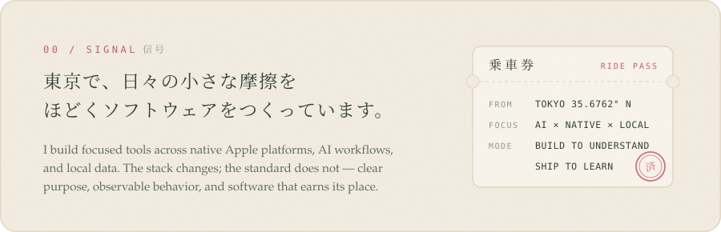

  <a href="https://github.com/kekincai/DiskFerry">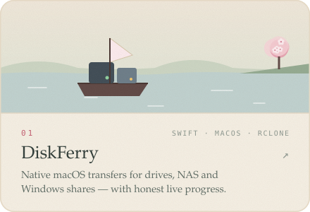</a>
  <a href="https://github.com/kekincai/fde">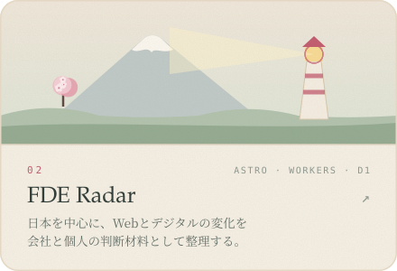</a>

  <a href="https://github.com/kekincai/CoBRA">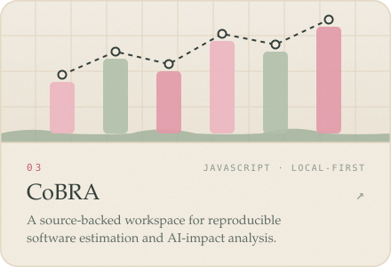</a>
  <a href="https://github.com/kekincai/bookmark-cover-flow">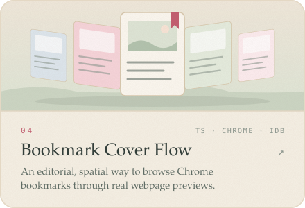</a>

  <a href="https://github.com/kekincai/taskpaper-mcp-server">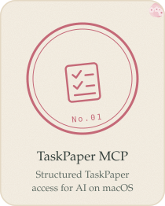</a>
  <a href="https://github.com/kekincai/telegram-drive-macos">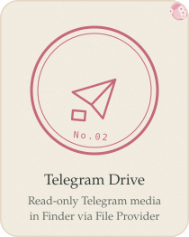</a>
  <a href="https://github.com/kekincai/safe-clip-popclip">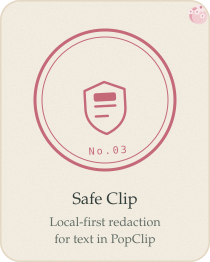</a>
  <a href="https://github.com/kekincai/llm-racket">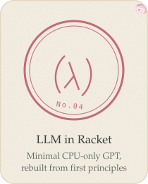</a>

  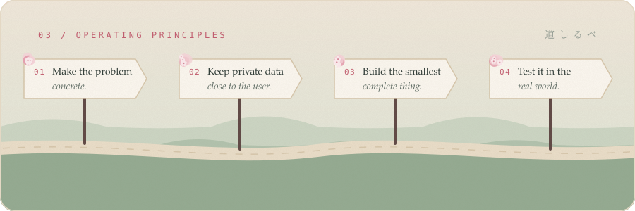

  

