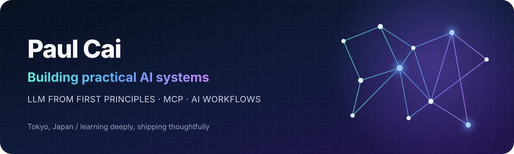

<p align="center">
  
</p>

<p align="center">
  <a href="https://github.com/kekincai?tab=repositories"></a>
  <a href="https://github.com/kekincai/taskpaper-mcp-server"></a>
  <a href="https://github.com/kekincai/llm-racket"></a>
</p>

## Hello, I'm Paul 👋

I'm an AI-focused builder in Tokyo, turning ideas into small, useful systems. I enjoy understanding language models from first principles, connecting AI to real tools through MCP, and building thoughtful native apps for macOS.

> **Current focus:** practical AI agents, Model Context Protocol, local-first workflows, and learning by rebuilding the fundamentals.

## Featured AI work

| Project | What it explores | Built with |
| :--- | :--- | :--- |
| [**TaskPaper MCP Server**](https://github.com/kekincai/taskpaper-mcp-server) | Gives AI assistants structured access to TaskPaper on macOS | TypeScript · MCP |
| [**LLM in Racket**](https://github.com/kekincai/llm-racket) | Rebuilds Karpathy's `llm.c` approach for minimal, CPU-only GPT training | Racket · GPT |
| [**LLM in R**](https://github.com/kekincai/llm.r) | Implements a GPT-2 training framework in pure R | R · GPT-2 |
| [**PDF Outline Skill**](https://github.com/kekincai/pdf-add-outline-skill) | Lets Codex add PDF bookmarks from printed tables of contents | Python · Codex |

## What I'm exploring

```text
AI systems       → agents, tool use, context, evaluation
LLM internals    → tokenization, training loops, inference
Local-first      → private workflows that stay close to your data
Human + AI       → tools that amplify judgment instead of replacing it
```

## Toolbox

<p>
  
</p>

<p>
  
  
  
  
</p>

## A little more about me

- 🧠 I learn best by rebuilding things from the ground up.
- 🛠️ I like software that is focused, local-first, and genuinely useful.
- 🌏 Based in Tokyo, working across Chinese, English, and Japanese contexts.
- 📈 My background in data analysis keeps me curious about how models really behave.

## GitHub at a glance

<p align="center">
  
  
</p>

<p align="center">
  <a href="https://github.com/kekincai?tab=repositories">Explore my projects</a>
  &nbsp;·&nbsp;
  <a href="https://stackoverflow.com/users/8745472">Stack Overflow</a>
  &nbsp;·&nbsp;
  <a href="https://www.leetcode.com/jin-tai-yang-wu-di">LeetCode</a>
</p>

<p align="center"><sub>Build to understand. Ship to learn.</sub></p>
